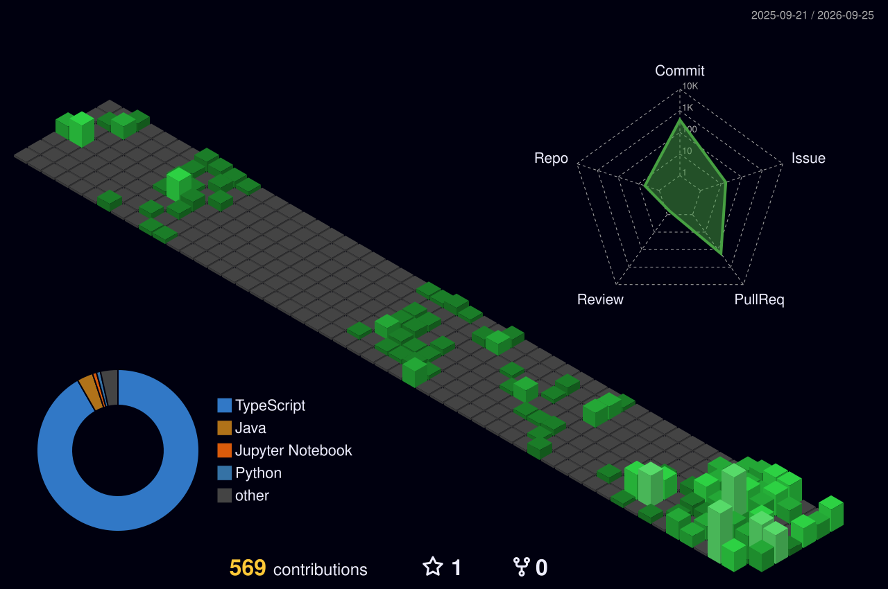

# Projects

## UTEUM (으뜸)

> PDF 강의 자료를 기반으로 설명, 질의응답, 퀴즈와 오개념 교정을 제공하는 AI 학습 플랫폼

- **Role:** Frontend Developer
- React와 TypeScript 기반의 역할별 학습 서비스 UI 개발
- 인증 세션 복원, PDF 학습 세션, AI 채팅과 퀴즈 흐름 구현
- Spring API 연동과 오류·로딩·빈 상태 처리
- 반응형 UI와 테스트 및 CI 기반의 품질 관리

`React` `TypeScript` `Vite` `Tailwind CSS` `Vitest` `Testing Library`

## JOONGSIM

> 브랜드의 정체성과 콘텐츠를 전달하는 공식 웹페이지 구축 예정

- **Role:** Full-stack Developer & Server Operator
- 브랜드 페이지의 프론트엔드 설계 및 반응형 UI 개발
- 서비스 운영에 필요한 백엔드와 데이터 관리 기능 개발
- 배포 환경 구성부터 서버 운영, 모니터링과 유지보수까지 담당 예정
- **Instagram:** [@joongsim.official](https://www.instagram.com/joongsim.official/)

`Frontend` `Backend` `Deployment` `Server Management`

 

# Tech Stack

### Main

### Experience

### Collaboration & Tools

 

# Experience & Awards

### 2024

- 2024학년도 레고 모빌리티 자율주행 경주대회

### 2025

- 2025 대경권 대학생 프로그래밍 경진대회
- 2025 레고 모빌리티 자율주행 경주대회
- 9oormthonUNIV 4기 울산대학교 Web Frontend Developer

### 2026

- 캡스톤 디자인 경진대회 — 최우수상
- 울산대학교 제1회 AI 활용 사회문제 해결 아이디어 공모전 — 장려상
- WAVE 2026 대학생 AI/SW 아이디어 피칭대회 — 우수상

 

# GitHub Activity

